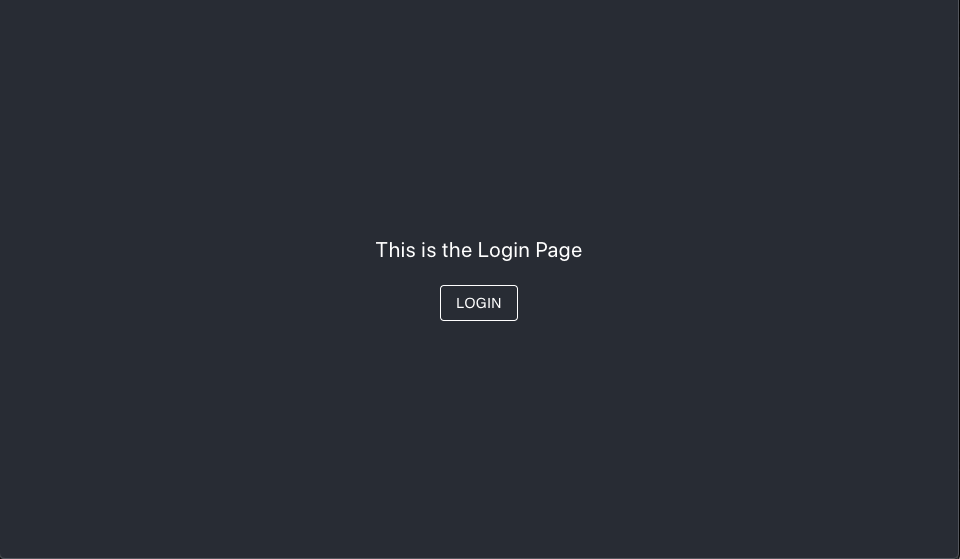
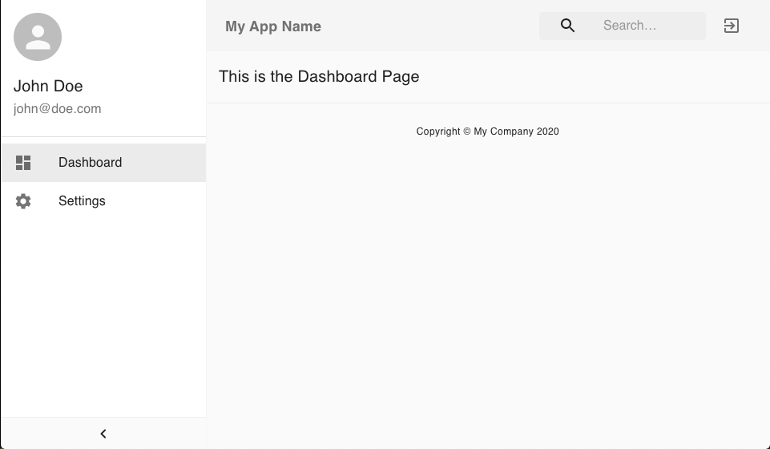

# React Material Dashboard Starter

Minimal [React JS](https://reactjs.org/) project for those how are beginners and want a starter template that is simple
and functional. Also are the use of [React Router](https://reacttraining.com/react-router/web/guides/quick-start) 
for routing management.

## Other cool stuff that were used:

##### 1- [Create React App](https://github.com/facebook/create-react-app) for project structure.
##### 2- [Material UI](https://material-ui.com/) for designed components.
##### 3- [MUI Treasury](https://mui-treasury.com/) for pre-build layouts.

## Project screens

## Start using the project
1- Clone the repository. 
2- In the project directory run:

##### `yarn install`
##### `yarn start`

Now the app is running in development mode. Open [http://localhost:3000](http://localhost:3000) to view it in the browser.
